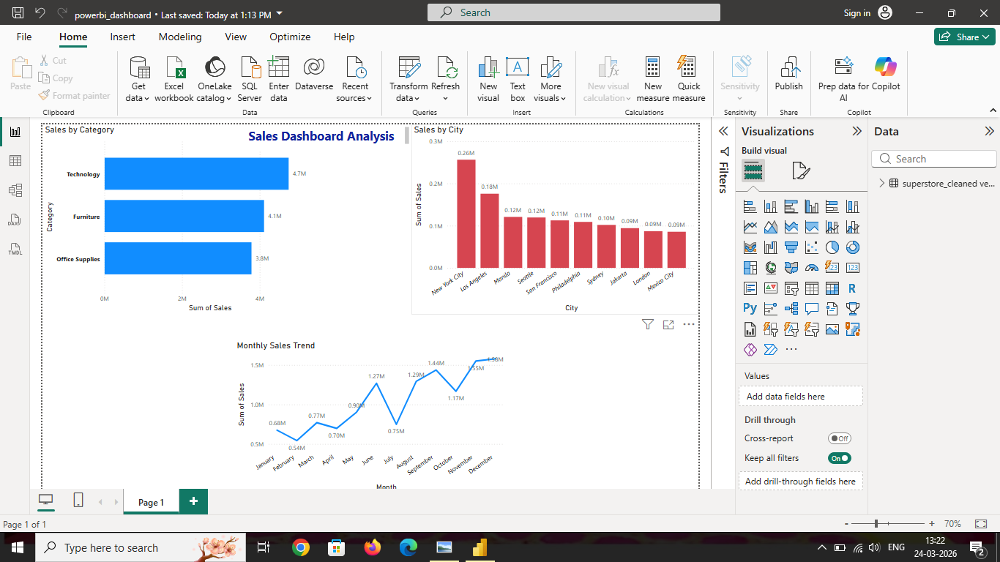

#  Sales Dashboard Project

#  Overview
This project analyzes retail sales data and presents insights using Excel, SQL, and Power BI.

#  Tools Used
- Excel (Data Cleaning & KPI)
- SQL (Data Analysis)
- Power BI (Dashboard Visualization)

#  Key Insights
- Sales by Category
- Top 10 Cities by Sales
- Monthly Sales Trend

#  Dashboard Preview

#  Dataset
Superstore dataset with 50,000+ rows.

#  Project Outcome
Built an interactive dashboard to analyze business performance and trends.
